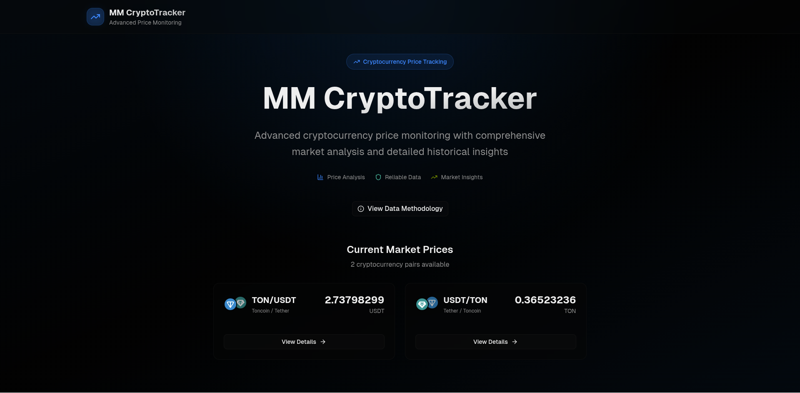
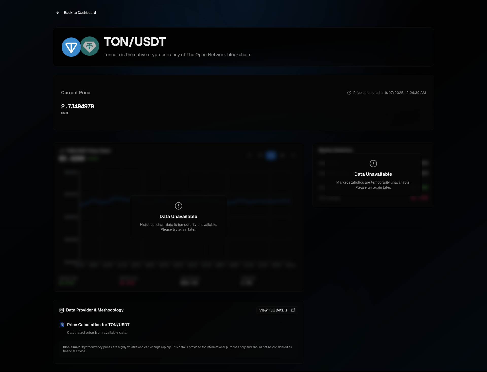
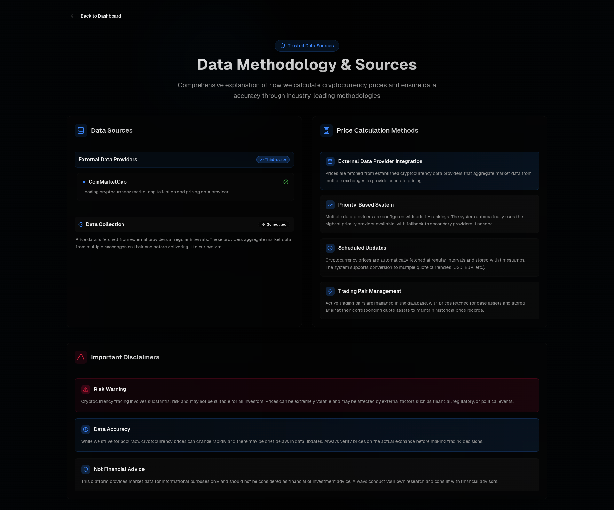

# MM CryptoTracker

[](https://github.com/4matic/mm-cryptotracker/actions)

A comprehensive cryptocurrency tracking application built with modern web technologies, featuring real-time price monitoring, historical data analysis, and advanced price calculation algorithms.

## 📸 Screenshots

| Home Page                                      | Trading Pair Details                           | Data Methodology                                             |
| ---------------------------------------------- | ---------------------------------------------- | ------------------------------------------------------------ |
|  |  |  |

## 📋 Table of Contents

- [Screenshots](#-screenshots)
- [Features](#-features)
- [Technology Stack](#-technology-stack)
- [Project Architecture](#-project-architecture)
- [Quick Start](#-quick-start)
  - [Prerequisites](#prerequisites)
  - [Project Setup](#project-setup)
  - [Running the Project](#running-the-project)
- [Useful links](#useful-links)
- [Documentation](#-documentation)
- [Development](#-development)
- [Docker & Deployment](#-docker--deployment)
- [Testing](#-testing)
- [What Can Be Improved](#-what-can-be-improved)
- [Contributing](#-contributing)
- [License](#-license)

## ✨ Features

- **Real-time Cryptocurrency Tracking**: Monitor live cryptocurrency prices from multiple data providers
- **Advanced Price Calculations**: Multi-hop indirect price calculation with confidence scoring
- **Historical Data Analysis**: Complete OHLCV data storage and visualization
- **Interactive Price Charts**: Responsive charts using Recharts with detailed market data
- **Data Provider Management**: Extensible system supporting multiple external APIs (CoinMarketCap, etc.)
- **GraphQL & REST APIs**: Dual API interfaces for flexible data access
- **Dark Mode Support**: Modern UI with dark theme and responsive design
- **Database Management**: Complete migration and seeding system
- **Real-time Updates**: Automated price fetching with configurable intervals
- **TypeScript**: Full type safety across the entire monorepo
- **Docker Support**: Complete containerization for development and production

## 🛠 Technology Stack

### Core Framework & Monorepo
- **[Nx 21.5.3](https://nx.dev)** - Smart monorepo tools with powerful caching and task orchestration
- **[Node.js 20+](https://nodejs.org)** - Runtime environment (npm package manager recommended)
- **[TypeScript 5.9+](https://www.typescriptlang.org)** - Type safety and modern JavaScript features

### Backend Technologies
- **[NestJS 11](https://nestjs.com)** - Enterprise-grade Node.js framework
- **[Fastify](https://www.fastify.io)** - High-performance web framework (via `@nestjs/platform-fastify`)
- **[GraphQL](https://graphql.org)** - Query language with Apollo Server integration
- **[MikroORM 6.5](https://mikro-orm.io)** - TypeScript ORM with PostgreSQL support
- **[PostgreSQL 17](https://www.postgresql.org)** - Primary database with Alpine Docker image
- **[Swagger/OpenAPI](https://swagger.io)** - API documentation and testing interface
- **[Pino](https://github.com/pinojs/pino)** - High-performance JSON logger
- **[Zod](https://zod.dev)** - Schema validation for configuration and DTOs

### Frontend Technologies
- **[Next.js 15.2](https://nextjs.org)** - React framework with App Router and Server Components
- **[React 19](https://react.dev)** - UI library with latest features
- **[Tailwind CSS 4](https://tailwindcss.com)** - Utility-first CSS framework
- **[Shadcn/ui](https://ui.shadcn.com)** - High-quality accessible UI components
- **[Radix UI](https://www.radix-ui.com)** - Low-level UI primitives
- **[Recharts](https://recharts.org)** - Chart library for data visualization
- **[Lucide React](https://lucide.dev)** - Beautiful icon library

### Development & Quality Tools
- **[Jest 30](https://jestjs.io)** - Testing framework with coverage reporting
- **[Playwright](https://playwright.dev)** - End-to-end testing
- **[ESLint 9](https://eslint.org)** - Code linting with TypeScript support
- **[Prettier 2.6](https://prettier.io)** - Code formatting
- **[GitHub Actions](https://github.com/features/actions)** - CI/CD pipeline

### DevOps & Deployment
- **[Docker](https://docker.com)** - Containerization with multi-stage builds
- **[Docker Compose](https://docs.docker.com/compose/)** - Multi-container orchestration
- **[Adminer](https://www.adminer.org)** - Database administration interface

### External APIs & Services
- **[CoinMarketCap API](https://coinmarketcap.com/api/)** - Primary cryptocurrency data provider
- **Extensible Provider System** - Support for multiple data sources with fallback

## 🏗 Project Architecture

This is an **Nx monorepo** with the following structure:

```
mm-cryptotracker/
├── apps/
│   ├── backend/                 # NestJS API server
│   ├── backend-e2e/            # Backend E2E tests
│   ├── frontend/               # Next.js web application
│   └── frontend-e2e/           # Frontend E2E tests
├── libs/
│   └── shared/
│       └── graphql/            # Shared GraphQL schema definitions
├── assets/
│   └── screenshots/            # Application screenshots
├── docker-compose.yml          # Development containers
├── docker-compose.prod.yml     # Production containers
└── .github/workflows/          # CI/CD pipeline
```

### Key Architecture Principles
- **Clean Architecture**: Layered design with clear separation of concerns
- **Type Safety**: End-to-end TypeScript with shared schema definitions
- **Modular Design**: Feature-based modules with dependency injection
- **API-First**: GraphQL and REST APIs with comprehensive documentation
- **Extensible Data Providers**: Plugin architecture for multiple price data sources
- **Container-Ready**: Full Docker support for development and production

## 🚀 Quick Start

### Prerequisites

Before getting started, ensure you have the following installed:

- **[Node.js 20+](https://nodejs.org)** - JavaScript runtime
- **[npm](https://npmjs.com)** - Package manager (comes with Node.js)
- **[Docker](https://docker.com)** - For PostgreSQL database
- **[Docker Compose](https://docs.docker.com/compose/)** - For container orchestration

### Project Setup

> **💡 Quick Setup Alternative**: For a simpler setup experience, skip the manual steps below and jump directly to **[Production Mode (Docker Deployment)](#-production-mode-docker-deployment)** which handles database setup, migrations, and seeding automatically.

#### Manual Setup (Development)

1. **Install dependencies**
   ```bash
   npm install
   ```

2. **Start database services**
   ```bash
   docker-compose up -d
   ```

3. **Configure environment variables**
   
   Copy the environment template files and configure your settings:
   ```bash
   # Copy environment template files
   cp apps/backend/.env.example apps/backend/.env.development
   cp apps/frontend/.env.example apps/frontend/.env
   ```
   
   **Important**: Update `apps/backend/.env.development` with required variables. This file contains all minimal setup needed to run the application. See **[`env.example`](env.example)** for all available configuration options:
   - Database password from `docker-compose.yml`
   - CoinMarketCap API key (optional - enables real-time price data fetching, system runs in demo mode without it)

4. **Setup database**
   ```bash
   # Run database migrations (fresh start)
   npx nx run @mm-cryptotracker/backend:migration:fresh
   ```

5. **Seed initial data**
   
   **⚠️ Before seeding, configure these environment variables in `apps/backend/.env`:**
   - `DATA_PROVIDER_COINMARKETCAP_API_KEY` - Your CoinMarketCap API key (optional - without it, system runs in demo mode)
   - `ASSETS_PUBLIC_URL` - Public URL for assets (e.g., `http://localhost:4000`)

   ```bash
   # Seed the database with initial cryptocurrency data
   npx nx run @mm-cryptotracker/backend:seeder:run
   ```

6. **Verify database setup** (Optional)
   
   Visit [http://localhost:8080](http://localhost:8080) to access Adminer and verify the data was seeded correctly.

### Running the Project

Choose your preferred setup method:

#### 🔧 Development Mode (Local Development)

**Two Terminal Setup** (Recommended for development)
```bash
# Terminal 1: Start backend API server
npx nx serve backend

# Terminal 2: Start frontend application  
npx nx serve frontend
```

**Individual Services** (For testing specific components)
```bash
# Backend only
npx nx serve backend      # API: http://localhost:4000

# Frontend only  
npx nx serve frontend     # Web: http://localhost:3000
```

#### 🐳 Production Mode (Docker Deployment)

**Using [`docker-compose.prod.yml`](docker-compose.prod.yml)** - Production-optimized container orchestration:

This production configuration provides a complete containerized environment with:
- **PostgreSQL 17 Database** with persistent data volumes
- **Optimized Backend API** (multi-stage Docker build)  
- **Frontend Application** (Next.js standalone output)
- **Database Admin Interface** (Adminer with Dracula theme)
- **CLI Tools** for migrations and seeding (via Docker profiles)

**Complete Production Setup**
```bash
# Configure environment and deploy everything using docker-compose.prod.yml
cp env.example .env && \
docker-compose -f docker-compose.prod.yml up -d database && \
docker-compose -f docker-compose.prod.yml --profile cli run --rm cli migration:fresh && \
docker-compose -f docker-compose.prod.yml --profile cli run --rm cli seeder:run && \
docker-compose -f docker-compose.prod.yml up -d && \
docker-compose -f docker-compose.prod.yml ps
```

**📋 Important**: Edit the `.env` file with a secure database password before running. Optionally add your CoinMarketCap API key for real-time price data (system runs in demo mode without it). The `docker-compose.prod.yml` file uses these environment variables for production configuration. See **[Production Setup Guide](PRODUCTION_SETUP.md)** for detailed configuration and troubleshooting.

#### 🌐 Access Your Application

Once running, visit these URLs:
- **🏠 Frontend Web App**: [http://localhost:3000](http://localhost:3000)
- **🔧 Backend API**: [http://localhost:4000](http://localhost:4000)
- **🔍 GraphQL Playground**: [http://localhost:4000/graphql](http://localhost:4000/graphql)
- **📚 API Documentation**: [http://localhost:4000/api](http://localhost:4000/api)
- **🗄️ Database Admin**: [http://localhost:8080](http://localhost:8080)

## Useful links

Learn more:

- [Learn more about this workspace setup](https://nx.dev/nx-api/node)
- [Learn about Nx on CI](https://nx.dev/ci/intro/ci-with-nx)
- [Releasing Packages with Nx release](https://nx.dev/features/manage-releases)
- [What are Nx plugins?](https://nx.dev/concepts/nx-plugins)

## 📚 Documentation

### Quick Reference Files
- **[`env.example`](env.example)** - Environment variables template with all configuration options for [docker-compose.prod.yml](docker-compose.prod.yml)
- **[`LICENSE.md`](LICENSE.md)** - Complete license terms and usage permissions

### Application Documentation
- **[Production Setup Guide](PRODUCTION_SETUP.md)** - Complete production deployment instructions with Docker Compose
- **[Backend API Documentation](apps/backend/README.md)** - NestJS backend with detailed architecture and API reference
- **[Frontend Application](apps/frontend/README.md)** - Next.js frontend with modern React patterns and components

### Backend Module Documentation
- **[Crypto Module](apps/backend/src/app/crypto/README.md)** - Core cryptocurrency functionality, entities, and services
  - Contains entity definitions, repositories, GraphQL resolvers, and business logic
  - Price calculation algorithms and trading pair management
- **[Price Fetching Module](apps/backend/src/app/price-fetching/README.md)** - External API integration and automated data fetching
  - CoinMarketCap API integration and data provider management

### Shared Libraries & Types
- **[Shared GraphQL Types](libs/shared/graphql/README.md)** - Common GraphQL schema definitions and type mappings
  - Cross-references database entities and frontend GraphQL queries

### API References & Interactive Tools
- **GraphQL Playground**: [http://localhost:4000/graphql](http://localhost:4000/graphql) - Interactive GraphQL API explorer
- **OpenAPI/Swagger Documentation**: [http://localhost:4000/api](http://localhost:4000/api) - REST API documentation
- **Database Administration**: [http://localhost:8080](http://localhost:8080) - Adminer interface for database management

### Build & Deployment Scripts
- **[`scripts/build-prod.sh`](scripts/build-prod.sh)** - Production build automation script
  - ⚠️ **Warning**: This script includes Docker system purge commands. Review carefully before execution.

## 🔧 Development

### Common Development Commands

```bash
# Development servers
nx serve backend          # Start backend in watch mode
nx serve frontend         # Start frontend in dev mode

# Building
nx build backend          # Build backend for production
nx build frontend         # Build frontend for production
nx run-many -t build      # Build all projects

# Testing
nx test backend           # Run backend unit tests
nx test frontend          # Run frontend tests
nx e2e backend-e2e        # Run backend E2E tests
nx e2e frontend-e2e       # Run frontend E2E tests
nx run-many -t test       # Run all tests

# Code quality
nx lint backend           # Lint backend code
nx lint frontend          # Lint frontend code
nx run-many -t lint       # Lint all projects

# Database operations
nx run @mm-cryptotracker/backend:migration:create    # Create migration
nx run @mm-cryptotracker/backend:migration:up        # Run migrations
nx run @mm-cryptotracker/backend:seeder:run          # Run seeders
```

### Project Graph Visualization
```bash
npx nx graph              # Visual project dependency graph
```

## 🐳 Docker & Deployment

### Development with Docker
```bash
# Start all services (PostgreSQL + Adminer)
docker-compose up -d

# View logs
docker-compose logs -f

# Stop services
docker-compose down
```

### Production Deployment

**Quick Production Setup**:
```bash
# 1. Configure environment variables first (see env.example)
cp env.example .env
# Edit .env with your production settings

# 2. Standard production deployment process
docker-compose -f docker-compose.prod.yml up -d database
docker-compose -f docker-compose.prod.yml --profile cli run --rm cli migration:fresh
docker-compose -f docker-compose.prod.yml --profile cli run --rm cli seeder:run
docker-compose -f docker-compose.prod.yml up -d

# 3. Monitor deployment
docker-compose -f docker-compose.prod.yml ps
docker-compose -f docker-compose.prod.yml logs -f
```

**Alternative One-Command Deployment** (legacy):
```bash
# Build and run everything at once
docker-compose -f docker-compose.prod.yml up --build -d
```

**Access Production Services**:
- **Frontend**: [http://localhost:3000](http://localhost:3000)
- **Backend API**: [http://localhost:4000](http://localhost:4000)
- **Database Admin**: [http://localhost:8080](http://localhost:8080)

**📖 [Complete Production Setup Guide](PRODUCTION_SETUP.md)** - Comprehensive deployment documentation with troubleshooting

### Docker Configuration
- **Backend**: Optimized multi-stage build with `Dockerfile.prod`
- **Frontend**: Next.js standalone output for minimal container size
- **Database**: PostgreSQL 17 Alpine with persistent volumes
- **Admin**: Adminer with Dracula theme for database management

### Build Automation
- **[`scripts/build-prod.sh`](scripts/build-prod.sh)** - Automated production build script
  - ⚠️ **Warning**: Script includes Docker system purge operations that remove all unused containers, networks, and images. Review before use.

## 🧪 Testing

### Testing Strategy
- **Unit Tests**: Jest for services and components
- **Integration Tests**: Database and API integration testing
- **E2E Tests**: Playwright for full user journey testing
- **Type Checking**: TypeScript strict mode validation

### Running Tests
```bash
# All tests
nx run-many -t test

# Backend tests
nx test backend --coverage

# Frontend tests  
nx test frontend --watch

# E2E tests
nx e2e frontend-e2e
nx e2e backend-e2e

# CI pipeline tests
nx run-many -t lint test build typecheck
```

### Continuous Integration
GitHub Actions pipeline includes:
- Code quality checks (lint, typecheck)
- Unit and integration tests
- E2E tests with Playwright
- Build verification for all projects

## 🔮 What Can Be Improved

### Backend Enhancements
- **HTTP Authentication for Swagger**: Move from `/api` route to `/swagger`, `/api` should serve OpenAPI JSON schema
- **API Security**: Implement proper authentication and rate limiting
- **Advanced Analytics**: Historical trend analysis and technical indicators
- **WebSocket Support**: Real-time price updates via WebSocket connections
- **Caching Layer**: Redis integration for high-frequency data caching

### Frontend Improvements
- **Historical Data Visualization**: Show historical price data and market statistics on the trading pair page
- **Advanced Charting**: Multiple timeframes, technical indicators, and comparison tools
- **Portfolio Tracking**: User portfolio management and P&L tracking
- **Mobile App**: React Native or PWA for mobile experience
- **Notifications**: Price alerts and portfolio notifications

### Development Experience
- **GraphQL Code Generation**: Add `.d.ts` files generator for `.gql` files in `apps/frontend/src/graphql/`
  - **Type Safety**: Generate TypeScript types from GraphQL schema and queries for compile-time validation
  - **IntelliSense Support**: Get autocomplete and error detection for GraphQL query fields and variables
  - **Query Validation**: Detect missing or unused fields at build time, preventing runtime errors
  - **Schema Sync**: Automatically update types when backend GraphQL schema changes
  - **Developer Productivity**: Reduce boilerplate code and improve development speed with generated hooks and utilities
  - **Runtime Safety**: Know exactly which properties are available in returned data, eliminating guesswork
- **API Testing**: Comprehensive API test suite with fixtures
- **Monitoring**: Application performance monitoring and error tracking
- **Documentation**: Interactive API documentation with examples

### DevOps & Infrastructure
- **Kubernetes**: Production-ready Kubernetes manifests
- **Monitoring**: Prometheus metrics and Grafana dashboards  
- **Logging**: Centralized logging with ELK stack
- **Security**: Security scanning and vulnerability management

## 🤝 Contributing

This is a personal project, so external contributions are not expected. However, the codebase follows best practices:

### Code Quality Standards
- **TypeScript**: Strict mode enabled for all code
- **Testing**: >80% coverage target for critical paths
- **Linting**: ESLint with TypeScript and Prettier integration
- **Documentation**: JSDoc for public APIs and comprehensive READMEs

### Development Guidelines
- Follow **Clean Architecture** principles
- Use **Dependency Injection** for service management
- Implement **Repository Pattern** for data access
- Write **comprehensive tests** for new features
- Update **documentation** for API changes

## 📄 License

This is a personal project with all rights reserved. See **[LICENSE.md](LICENSE.md)** for complete license terms and usage permissions.

**Summary**: Educational reference and study permitted • Commercial use prohibited • Respect intellectual property

**Technologies Used**: All third-party libraries and frameworks maintain their respective licenses.

---

<div align="center">
  <p><strong>Built with ❤️ using modern web technologies</strong></p>
  <p><em>Nx • NestJS • Next.js • TypeScript • GraphQL • PostgreSQL</em></p>
</div>
